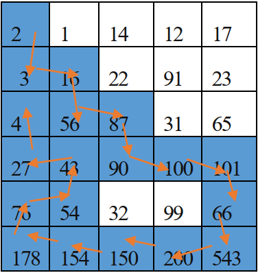

## Bài toán tìm đường đi cho robot 🤖

### 📝 Mô tả
Cho mảng 2 chiều chứa các số nguyên dương (không trùng nhau) mô phỏng mê
cung, 1 robot được đặt ở vị trí (x,y). Robot chỉ có thể đi theo 4 hướng(trên, dưới, trái, phải).
Robot sẽ lựa chọn hướng(ô) có giá trị lớn để đi, các ô đi rồi sẽ không đi lại. Điểm được tính
bằng tổng giá trị các ô robot đi qua.

### 🎈 Ví dụ
`input.txt`
```
6 
5
2 1 14 12 17
3 16 22 91 23
4 56 87 31 65
27 43 90 100 101
76 54 32 99 66
178 154 150 200 543
```
**Kết quả mong đợi** với (x, y) = (0, 0)

`output.txt`
```
Score: 1950
Path: [2, 3, 16, 56, 87, 90, 100, 101, 66, 543, 200, 150, 154, 178, 76, 54, 43, 27, 4]
```
**Minh hoạ đường đi**




